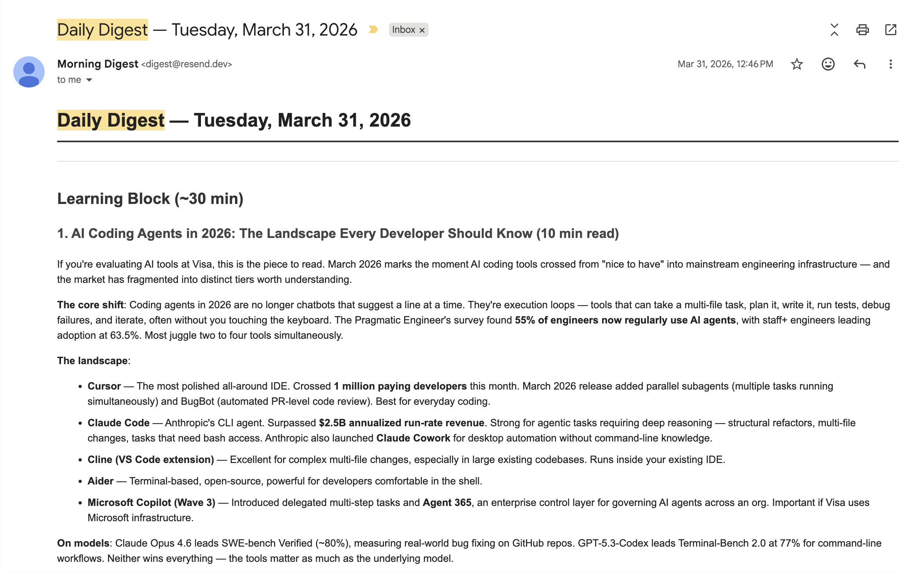

# Morning Digest

**Wake up to a personalized daily learning digest written by AI from sources *you* care about, in your inbox before you finish your coffee.**

Curated RSS + Hacker News, ranked by your real interests, summarized by Claude Haiku against the actual article body, delivered as a clean HTML email with one-click feedback buttons. Tap a reaction → tomorrow's email adapts.



> 📬 [See more in the sample digest](daily/sample-digest.md).

```
30 minutes of learning + 15 minutes of news, every morning, $0–3/month.
```

**Built with:** Claude Code (scheduled agent) · sentence-transformers (MiniLM) · scikit-learn · Claude Haiku (reranker + judge) · GitHub Actions · Cloudflare Workers · Resend

---

## Why this exists

I wanted to learn something new every morning without the work of curating it myself. Newsletters are generic. ChatGPT forgets you. Readwise charges $10/mo and doesn't write content. Twitter is hostile to learning. So:

- **Built around *your* interests, not a publisher's editorial line.** Edit a markdown file, get a different digest tomorrow.
- **Adapts to your taste from a single click.** No 10-question onboarding survey, no rating sliders. The buttons are 👍 / 🔬 / 📈 / 📉 / 👋. Five days of clicks and the ranker starts learning what you actually open.
- **Self-hosted, fully transparent.** Every ranking decision, every reaction, every summary — all in your own GitHub repo, version-controlled. Inspect it, edit it, leave it.
- **Cheap.** $0/mo on free tiers if you skip the Haiku reranker. ~$2/mo with everything on (~$0.07/day for 30 Haiku rerank calls). Cheaper than one coffee.

Not for: someone who wants a polished consumer SaaS. This is a self-hosted system for people comfortable with `git clone` and a 10-minute setup script.

---

## How it works

```
sources.yml ──► fetch.py ──► embed.py ──► STAGE 1: coarse cosine recall over ~250 items
                                                            │
                                                            ▼  top 30
                                          STAGE 2: extract.py fetches article bodies,
                                          rerank.py asks Claude Haiku per item:
                                            {relevance 1-10, personalized summary}
                                                            │
                                                            ▼
                                          daily/candidates-YYYY-MM-DD.json
                                                            │
                                                            ▼
                            Claude Code scheduled agent picks 2-3 learning + 3-5 news,
                            writes daily/YYYY-MM-DD.md + a manifest for feedback joining
                                                            │
                                                            ▼  GitHub Action
                                              Resend renders + sends email
                                                            │
                            You read it, click a button → Cloudflare Worker writes
                            an event → nightly LogReg retrains on accumulated reactions
```

Two-stage retrieval is *the* pattern in modern search systems — cheap recall narrows 250 → 30, expensive precision rerank gets the top 16 right. Per-item failure isolation: a paywalled article body just falls back to the RSS summary, the rest of the digest proceeds.

For the math (recency half-life, label join, eval metrics), see [`docs/architecture.md`](docs/architecture.md) <!-- TODO: write this -->.

---

## Get started

You'll need: a GitHub account (free), a [Resend](https://resend.com) account (free), a [Cloudflare](https://cloudflare.com) account (free), and a [Claude Code](https://claude.ai/code) subscription (which you probably have if you're reading this).

### 1. Create your repo from this template
Click **"Use this template"** at the top of this page → **Create a new repository** (make it private), then clone it.

### 2. Run the setup script
```bash
./scripts/setup.sh
```
It walks you through: GitHub auth, seeding `interests.md`, setting Resend/email secrets, deploying the Cloudflare Worker, generating the feedback secret, and flipping workflow permissions. Idempotent — safe to re-run. Manual fallback in [`docs/manual-setup.md`](docs/manual-setup.md).

### 3. Schedule the agent
Install the [Claude GitHub App](https://claude.ai/code/onboarding?magic=github-app-setup), grant it access to your repo, then in Claude Code run `/schedule` and tell it:

```
Create a scheduled trigger called "morning-digest" that runs daily at 7am my time.
Repo: <your repo URL>
Tools: Bash, Read, Write, Edit, Glob, Grep, WebSearch
Prompt: .github/prompts/digest-agent.txt
```

That's it. Tomorrow morning you'll get an email. Run `./scripts/verify.sh` to confirm everything is wired up.

---

## Personalize it

### Your interests
Edit `interests.md`. Free-form markdown table with priorities and depth — the ranker reads each row as a separate signal. Add or remove rows whenever. You can also use the "Add a feedback note" link in your email.

### Your sources
Edit `sources.yml`. Add RSS feeds, set categories. The pipeline rotates across them daily. Or use the "Suggest a source" link in your email.

### Feedback buttons
Each section gets these:

| Button | Signal |
|---|---|
| 👍 More like this | Reuse this topic / depth / source |
| 🔬 Go deeper | Dedicate more time to this topic next time |
| 📈 Too basic | Raise the difficulty for this topic |
| 📉 Too advanced | Lower the difficulty |
| 👋 Not interested | Deprioritize this topic |
| 🔁 Seen this | Drop this exact item — already saw it / repetitive |

Plus a freeform feedback form for anything that doesn't fit the buttons.

---

## What happens when you miss a day

The agent detects extended absence from your email-open history and adjusts:

| Scenario | What you get |
|---|---|
| You read recently | Full digest — 30 min learning + 15 min news |
| 8–14 days gone | Welcome-back digest — catch-up news + one short learning item |
| 15+ days gone | News-only catch-up. Learning resumes next day. |

System defaults to full digest. "Read" is detected via Resend's email-open webhook, not feedback clicks — you don't have to interact to count as present.

---

## Technical depth (for the curious)

**Ranking.** A scikit-learn logistic regression over 11 engineered features (cosine sim against interest paragraphs, log-age, smoothed source CTRs, category one-hot). Auto-falls back to cold-start cosine when fewer than 50 labels are available — so the system works on day one.

**Two-stage retrieval.** Cheap stage 1 (MiniLM bi-encoder cosine, 250 items in seconds) → top 30 → expensive stage 2 (Claude Haiku per item, ~$0.07/day total). Bodies are cached in SQLite so re-runs hit the DB, not the network.

**Training loop.** Cloudflare Worker writes structured events to `data/events.jsonl` (clicks, opens) → nightly workflow joins reactions to specific items via a per-day digest manifest → retrains the LogReg and force-commits `data/ranker.pkl`.

**Evaluation.** Two tracks: (a) leave-one-day-out CV with macro nDCG@5, recall@5, and category/source entropy — gates PRs with a 10% regression tolerance in CI; (b) a weekly Claude Haiku LLM-judge that scores recent digests 1–5 against `interests.md`, independent of feedback volume.

**Diversity.** Hard source cap (≤2 per source per section) guarantees at least 4 publications per section. Category split (learning vs news) guarantees topic diversity. Agent prompt rotates topics across the week.

Source code is small and readable — `pipeline/` is ~1.5k lines of Python. Start with `pipeline/rank.py:run` and follow the arrows.

---

## Cost breakdown

| Service | Free tier | What you'll use |
|---|---|---|
| Claude Code scheduled agent | Included in your plan | 1 run/day |
| GitHub Actions | 2,000 min/mo for private repos | ~3 min/day = ~90 min/mo |
| Resend | 3,000 emails/mo | 30/mo |
| Cloudflare Workers | 100k req/day | ~5/day |
| Claude Haiku reranker | Pay-as-you-go | ~$2/mo at default settings, optional |

**Total: $0/mo without the Haiku reranker, ~$2/mo with it on.** Disable stage 2 by leaving `ANTHROPIC_API_KEY` unset. Prefer Gemini? Set `GEMINI_API_KEY` instead (Anthropic wins if both are set) — the reranker and judge use Gemini Flash, which has a free tier.

---

## Pulling template updates

A scheduled workflow pulls upstream improvements daily and auto-merges. Conflicts (rare) surface as a failed workflow run for you to resolve. To trigger manually: Actions tab → "Sync Template Updates" → Run workflow.

Manual flow:
```bash
git remote add template https://github.com/neelgun17/morning-digest.git
git fetch template
git merge template/main
```

Your personal files (`interests.md`, `feedback-log.md`, `daily/`, `data/`) are gitignored in the template so they never conflict.

---

## FAQ

**Can I use it without the Haiku reranker?**  Yes — leave `ANTHROPIC_API_KEY` unset and stage 2 silently skips. You get cold-start cosine ranking with RSS summaries. Free.

**Can I use Gemini instead of Claude for the reranker?**  Yes — set repo secret `GEMINI_API_KEY` (leave `ANTHROPIC_API_KEY` unset; Anthropic takes precedence when both exist). The stage-2 reranker and the weekly LLM-judge then use Gemini Flash (`gemini-2.5-flash`; override with a `GEMINI_MODEL` env var). Gemini's free tier covers the default ~30 calls/day.

**Can I use a different agent model?**  Yes. Specify when scheduling (e.g. Opus for deeper analysis, Haiku for faster).

**Can I skip email and read on GitHub?**  Yes. Skip the Resend step in setup. Digests still commit to `daily/`.

**Weekdays only?**  `cron: 0 12 * * 1-5` when scheduling. Or Mon/Wed/Fri: `0 12 * * 1,3,5`.

**How do I stop it?**  Disable the trigger at [claude.ai/code/scheduled](https://claude.ai/code/scheduled).

**Where do bugs go?**  GitHub Issues. PRs welcome. The codebase is small.

---

## Contributing

This is a self-hosted template, not a service — improvements come back to the template, then flow downstream via the auto-sync workflow. Ideas welcome:

- New sources / source categories
- Better ranking signals
- A web UI for editing interests (instead of markdown)
- Smarter exploration (bandits over the category space)

Open an issue first if it's a substantial change.

---

*Built by [@neelgun17](https://github.com/neelgun17). MIT licensed.* <!-- TODO: add LICENSE file -->
